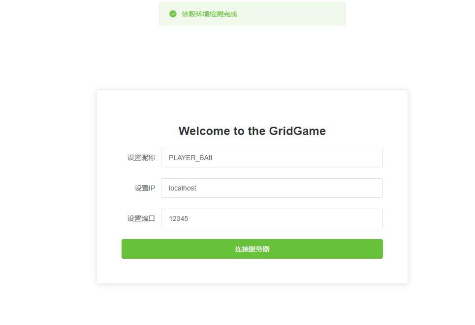
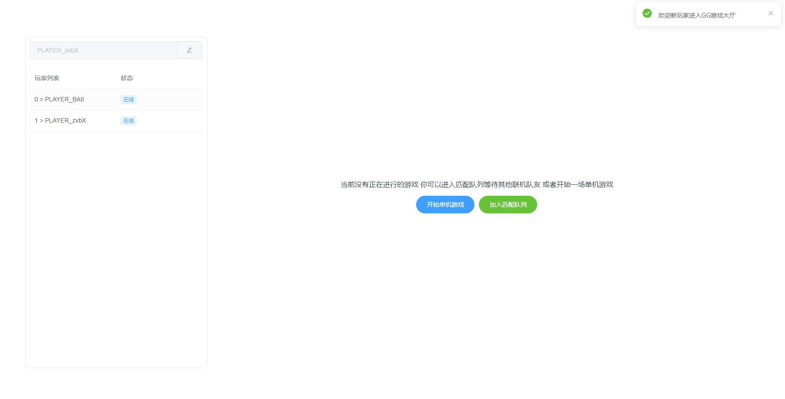
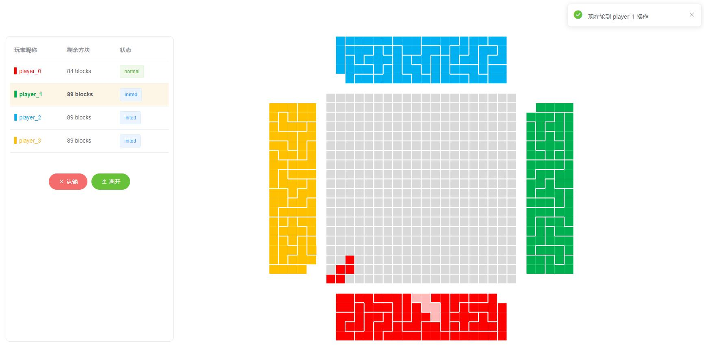

# 基于WebSocket的`方格游戏(online)`

该项目主要基于Node.js以及Vue开发完成，当前版本能够支持多人同时在线游玩、游戏匹配、消息通知等功能。

* 客户端和服务器通信使用WebSocket实现
* 客户端使用Vue+Element UI+Canvas实现

## 踩坑记录

虽然这是个很小的项目，但是在开发的过程中我们也遇到了很多的问题，我们将一些有意思的问题记录在这里。

- [x] 如何使用VSCode网页版浏览Github项目？将原Github项目地址的`github.com`修改为`github1s.com`

- [x] Vue中子组件同时向父组件传递多个值怎么实现？[答案](https://blog.csdn.net/weixin_43242112/article/details/108324304)
- [x] Vue怎么和WebSocket完美结合在一起，方便开发？[答案](https://www.jianshu.com/p/9d8b2e42328c)
- [x] 左右布局怎么实现？flex？absolute布局？[答案](https://jingyan.baidu.com/article/86112f1327a67366379787da.html)
- [x] websocket客户端在连接服务器的时候如何处理连接失败的情况？
- [x] 父子组件如何同步更新数据，即在父组件中修改数据后如何将更新后的结果传递给子组件？
  - [x] 使用watch或者computed即可更新
- [ ] 如何合理地设计该项目框架，尽可能降低各个模块之间的耦合性？
- [ ] vue中watch和computed的用法以及区别？

## 部分界面截图

